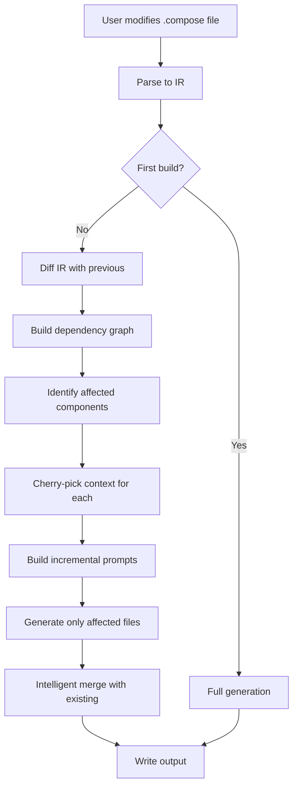

# Incremental Code Generation

> **Status**: Planning / RFC  
> **Last Updated**: 2025-11-25

## Overview

This document outlines strategies for optimizing Compose's code generation system to intelligently fetch and inject only the necessary code changes, rather than regenerating the entire application on every prompt modification.

### Current Challenges

The current implementation ([code-emitter.js](../compiler/emitter/code-emitter.js)) regenerates the **entire application** on every change:

```javascript
// In v0.2.0, we send the ENTIRE IR to the LLM at once
const prompt = createFullProjectPrompt(ir, this.target);
const generatedCode = await this.llmClient.generate('', prompt);
```

**Pain Points:**
- 💸 **Cost**: $5-20 per build (50+ files)
- ⏱️ **Time**: 30-120 seconds per build
- 📝 **Manual changes**: Overwritten on each regeneration
- 🔄 **Token waste**: Most code unchanged between iterations
- 📊 **Git noise**: Massive diffs even for small changes

---

## Proposed Strategies

### 1. Differential IR Analysis

**Concept**: Track changes in the IR and regenerate only affected components.

#### Key Components

**IR Change Detection**
```javascript
class IRDiffer {
  detectChanges(newIR) {
    return {
      addedModels: [],
      modifiedModels: [],
      deletedModels: [],
      addedFeatures: [],
      modifiedFeatures: [],
      // ...
    };
  }
}
```

**Dependency Graph**
```javascript
class DependencyGraph {
  getAffectedComponents(changes) {
    // Returns set of components impacted by changes
    // Includes transitive dependencies
  }
}
```

**Component-to-File Mapping**
```javascript
class ComponentFileMapper {
  mapFiles(ir) {
    // Maps models/features to their generated files
    return {
      models: { User: ['models/User.ts', 'api/users/*'] },
      features: { Authentication: ['components/login/*', 'api/auth/*'] }
    };
  }
}
```

| Pros | Cons |
|------|------|
| ✅ 60-90% cost reduction | ❌ Complex dependency tracking |
| ✅ Faster iteration | ❌ Risk of stale dependencies |
| ✅ Preserves unchanged files | ❌ Requires IR versioning |

---

### 2. Smart Prompt Structuring

**Concept**: Include existing code context and request only deltas.

#### Context-Aware Prompts

```javascript
class SmartPromptBuilder {
  buildIncrementalPrompt(ir, changes, existingCode) {
    return `You are updating an existing ${this.target.framework} application.

**Context:**
- Existing models: ${existingCode.models.map(m => m.name).join(', ')}
- Total files: ${existingCode.files.length}

**Changes:**
- NEW Models: ${changes.addedModels.map(formatModel)}
- MODIFIED Models: ${changes.modifiedModels.map(formatDiff)}

**Task:**
Update ONLY the affected files. DO NOT regenerate unchanged components.`;
  }
}
```

#### Prompt Cherry-Picking

```javascript
class PromptCherryPicker {
  pickRelevantContext(ir, targetComponent) {
    // For a feature, include only related models
    // For a model, include only features that use it
    return { models: [...], features: [...], guides: [...] };
  }
}
```

| Pros | Cons |
|------|------|
| ✅ Reduced token usage | ❌ May miss global context |
| ✅ More focused outputs | ❌ Requires careful selection |
| ✅ Faster responses | ❌ Multiple passes for complex changes |

---

### 3. Intelligent Code Merging

**Concept**: Use AST-aware merging to combine existing code with generated updates.

#### AST-Based Merging

```javascript
class IntelligentMerger {
  smartMerge(existingAST, generatedAST) {
    // Extract exports from both versions
    // Add new exports, merge existing ones
    // Preserve sections marked with @custom
  }
}
```

#### Three-Way Merge

```javascript
class ThreeWayMerger {
  merge(baseline, current, generated) {
    // Use git-like diff3 algorithm
    // Apply non-conflicting changes automatically
    // Mark conflicts for manual resolution
  }
}
```

#### Developer Annotations

```javascript
// @compose:preserve
function myCustomLogic() {
  // This won't be overwritten
}

// @compose:auto
export const defaultConfig = {
  // This will be regenerated
};
```

| Pros | Cons |
|------|------|
| ✅ Preserves manual changes | ❌ Complex AST manipulation |
| ✅ Minimal conflicts | ❌ Language-specific parsers |
| ✅ Fine-grained control | ❌ Performance overhead |

---

### 4. Hybrid Approach ⭐ (Recommended)

Combine all strategies for optimal results:

```javascript
class HybridCodeGenerator {
  async generateIncremental(previousIR, existingCode) {
    // 1. Detect changes
    const changes = this.differ.detectChanges(this.ir);
    
    // 2. Determine affected components
    const affected = this.depGraph.getAffectedComponents(changes);
    
    // 3. Build smart prompts for each affected component
    const prompts = this.buildIncrementalPrompts(affected, changes, existingCode);
    
    // 4. Generate code for affected components only
    const generated = await this.generateCode(prompts);
    
    // 5. Merge with existing code
    return this.merger.mergeAll(existingCode, generated);
  }
}
```

#### Workflow



---

## Implementation Roadmap

### Phase 1: Foundation (Weeks 1-2)
- [ ] Implement IR diffing (`ir-differ.js`)
- [ ] Add file-level caching with hash-based deduplication
- [ ] Track IR versions (save snapshots in `.compose/cache/`)

### Phase 2: Smart Generation (Month 1)
- [ ] Build dependency graph (`dependency-graph.js`)
- [ ] Implement smart prompt builder (`smart-prompt-builder.js`)
- [ ] Add annotation support (`@compose:preserve`, `@compose:auto`)

### Phase 3: Advanced Merging (Months 2-3)
- [ ] AST-based merging (`code-merger.js`)
- [ ] Three-way merge with conflict resolution
- [ ] Optimize LLM calls (parallel generation, retry logic)

### Phase 4: Polish
- [ ] Add `--incremental` CLI flag
- [ ] Merge conflict resolution workflow
- [ ] Comprehensive test suite
- [ ] Update documentation

---

## Usage Examples

```bash
# First build - full generation
compose build

# Modify User model - only regenerate User-related files
compose build --incremental

# Add new feature - only generate new feature files
compose build --incremental

# Force full rebuild
compose build --full
```

---

## Performance Projections

| Scenario | Current (Full) | Incremental | Savings |
|----------|---------------|-------------|---------|
| **Modify 1 model** | 50 files, $8, 60s | 8 files, $1.20, 12s | **85% cost, 80% time** |
| **Add 1 feature** | 50 files, $8, 60s | 12 files, $2, 18s | **75% cost, 70% time** |
| **Change guide** | 50 files, $8, 60s | 5 files, $0.80, 8s | **90% cost, 87% time** |
| **Modify 3 models** | 50 files, $8, 60s | 20 files, $3.50, 30s | **56% cost, 50% time** |

---

## Open Questions

1. **Merge strategy default**: Preserve manual changes or prefer generated code?

2. **Conflict resolution**: CLI prompt? Web UI? Special markers?

3. **Caching granularity**: File-level, component-level, or function-level?

4. **Partial failures**: Abort build? Continue with stale version? Retry?

5. **IR versioning**: Store history? How many versions?

6. **Performance targets**: 
   - Single model change: < 10s?
   - New feature: < 20s?
   - Multiple changes: < 40s?

7. **Annotation syntax**: Support `@compose:preserve`? Other markers?

---

## Related Documentation

- [LLM Integration](./llm-integration.md) - Current LLM setup
- [compose.json Configuration](./compose-json.md) - Target configuration
- [Reference Code](./reference-code.md) - Using reference code in prompts

---

## Contributing

This is an active design discussion. Feedback welcome on:
- Strategy preferences
- Implementation priorities
- Edge cases and constraints

Please open an issue or PR in the main repository.
