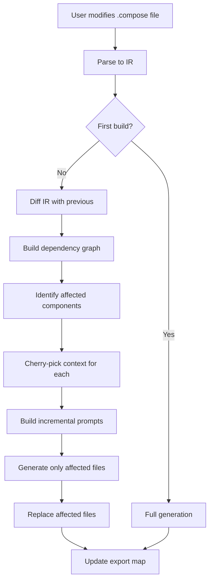

# Incremental Code Generation

> **Status**: Planning / RFC | **Critical Gap**: Drift detection not yet implemented  
> **Last Updated**: 2025-11-30 (Reddit feedback incorporated)

## Overview

This document outlines strategies for optimizing Compose's code generation system to intelligently fetch and inject only the necessary code changes, rather than regenerating the entire application on every prompt modification.

> **Important**: Compose is a **declarative code generation system**. Users edit `.compose` files, and all application code is **generated** from these files. Users do **not** manually edit the generated code. This assumption significantly simplifies incremental generation - we don't need to preserve manual changes or resolve merge conflicts.

### Current Challenges

The current implementation ([code-emitter.js](../compiler/emitter/code-emitter.js)) regenerates the **entire application** on every change:

```javascript
// In v0.2.0, we send the ENTIRE IR to the LLM at once
const prompt = createFullProjectPrompt(ir, this.target);
const generatedCode = await this.llmClient.generate('', prompt);
```

**Pain Points:**
- 💸 **Cost**: $5-20 per build (50+ files)
- ⏱️ **Time**: 30-120 seconds per build
-  **Token waste**: Most code unchanged between iterations
- 📊 **Git noise**: Massive diffs even for small changes
- 🚫 **Slow iteration**: Even trivial `.compose` changes trigger full rebuild

---

## Proposed Strategies

### 1. Differential IR Analysis

**Concept**: Track changes in the IR and regenerate only affected components.

#### Key Components

**IR Change Detection**
```javascript
class IRDiffer {
  detectChanges(newIR) {
    return {
      addedModels: [],
      modifiedModels: [],
      deletedModels: [],
      addedFeatures: [],
      modifiedFeatures: [],
      // ...
    };
  }
}
```

**Dependency Graph**
```javascript
class DependencyGraph {
  getAffectedComponents(changes) {
    // Returns set of components impacted by changes
    // Includes transitive dependencies
  }
}
```

**Component-to-File Mapping**
```javascript
class ComponentFileMapper {
  mapFiles(ir) {
    // Maps models/features to their generated files
    return {
      models: { User: ['models/User.ts', 'api/users/*'] },
      features: { Authentication: ['components/login/*', 'api/auth/*'] }
    };
  }
}
```

| Pros | Cons |
|------|------|
| ✅ 60-90% cost reduction | ❌ Complex dependency tracking |
| ✅ Faster iteration | ❌ Risk of stale dependencies |
| ✅ Preserves unchanged files | ❌ Requires IR versioning |

---

### 2. Smart Prompt Structuring

**Concept**: Include existing code context and request only deltas.

#### Context-Aware Prompts

```javascript
class SmartPromptBuilder {
  buildIncrementalPrompt(ir, changes, existingCode) {
    return `You are updating an existing ${this.target.framework} application.

**Context:**
- Existing models: ${existingCode.models.map(m => m.name).join(', ')}
- Total files: ${existingCode.files.length}

**Changes:**
- NEW Models: ${changes.addedModels.map(formatModel)}
- MODIFIED Models: ${changes.modifiedModels.map(formatDiff)}

**Task:**
Update ONLY the affected files. DO NOT regenerate unchanged components.`;
  }
}
```

#### Prompt Cherry-Picking

```javascript
class PromptCherryPicker {
  pickRelevantContext(ir, targetComponent) {
    // For a feature, include only related models
    // For a model, include only features that use it
    return { models: [...], features: [...], guides: [...] };
  }
}
```

| Pros | Cons |
|------|------|
| ✅ Reduced token usage | ❌ May miss global context |
| ✅ More focused outputs | ❌ Requires careful selection |
| ✅ Faster responses | ❌ Multiple passes for complex changes |

---

### 3. Export Map & Signature Tracking

**Concept**: Maintain a comprehensive index of all exported symbols with their full signatures, enabling the LLM to correctly import and use existing functions without seeing the entire codebase.

#### The Problem

When generating **new files** incrementally, the LLM needs to know:
- ✅ What functions/classes already exist
- ✅ Where they're located (file paths)
- ✅ **How to call them** (parameters, types, return values)
- ✅ **How to import them** (correct import paths)

Without this, you get broken imports, type mismatches, and duplicate code.

#### Export Map Structure

```javascript
// .compose/cache/export-map.json
{
  "models/User.ts": {
    "path": "src/models/User.ts",
    "exports": {
      "User": {
        "kind": "interface",
        "signature": "interface User { id: string; email: string; name: string; role: UserRole; }",
        "properties": ["id: string", "email: string", "name: string", "role: UserRole"]
      },
      "UserRole": {
        "kind": "enum",
        "signature": "enum UserRole { Admin = 'admin', User = 'user', Guest = 'guest' }",
        "values": ["Admin", "User", "Guest"]
      },
      "hashPassword": {
        "kind": "function",
        "signature": "async function hashPassword(password: string): Promise<string>",
        "params": [
          { "name": "password", "type": "string", "required": true }
        ],
        "returns": "Promise<string>",
        "async": true
      },
      "validateEmail": {
        "kind": "function",
        "signature": "function validateEmail(email: string): boolean",
        "params": [
          { "name": "email", "type": "string", "required": true }
        ],
        "returns": "boolean",
        "async": false
      }
    }
  },
  "utils/validation.ts": {
    "path": "src/utils/validation.ts",
    "exports": {
      "isEmail": {
        "kind": "function",
        "signature": "function isEmail(value: string): boolean",
        "params": [{ "name": "value", "type": "string", "required": true }],
        "returns": "boolean"
      },
      "sanitize": {
        "kind": "function",
        "signature": "function sanitize(input: string, options?: SanitizeOptions): string",
        "params": [
          { "name": "input", "type": "string", "required": true },
          { "name": "options", "type": "SanitizeOptions", "required": false }
        ],
        "returns": "string"
      }
    }
  }
}
```

#### Building the Export Map

Use AST parsing to extract signatures from generated code:

```javascript
class ExportMapBuilder {
  async buildFromFiles(generatedFiles, target) {
    const exportMap = {};
    const parser = this.getParser(target); // TypeScript, JavaScript, Python, etc.
    
    for (const file of generatedFiles) {
      const ast = await parser.parse(file.content);
      const exports = await this.extractExports(ast, file.path);
      
      exportMap[file.relativePath] = {
        path: file.path,
        exports: exports
      };
    }
    
    await this.saveToCache(exportMap);
    return exportMap;
  }
  
  async extractExports(ast, filePath) {
    const exports = {};
    
    // Find all export declarations
    for (const node of ast.body) {
      if (node.type === 'ExportNamedDeclaration') {
        const exported = this.extractExportedSymbol(node);
        if (exported) {
          exports[exported.name] = exported.metadata;
        }
      }
    }
    
    return exports;
  }
  
  extractExportedSymbol(node) {
    // Handle different export types
    if (node.declaration.type === 'FunctionDeclaration') {
      return this.extractFunction(node.declaration);
    }
    if (node.declaration.type === 'InterfaceDeclaration') {
      return this.extractInterface(node.declaration);
    }
    if (node.declaration.type === 'ClassDeclaration') {
      return this.extractClass(node.declaration);
    }
    // ... handle enums, types, etc.
  }
  
  extractFunction(node) {
    return {
      name: node.id.name,
      metadata: {
        kind: 'function',
        signature: this.nodeToString(node),
        params: node.params.map(p => ({
          name: p.name,
          type: this.extractType(p.typeAnnotation),
          required: !p.optional
        })),
        returns: this.extractType(node.returnType),
        async: node.async
      }
    };
  }
  
  extractInterface(node) {
    return {
      name: node.id.name,
      metadata: {
        kind: 'interface',
        signature: this.nodeToString(node),
        properties: node.body.properties.map(p => 
          `${p.key.name}: ${this.extractType(p.typeAnnotation)}`
        )
      }
    };
  }
}
```

#### Cherry-Picking for Prompts

Don't send the entire export map (too many tokens). Filter based on what's relevant:

```javascript
class ExportMapFilter {
  getRelevantExports(changes, exportMap, ir) {
    const relevant = {};
    
    // Example: Adding a Review model
    if (changes.addedModels.includes('Review')) {
      const reviewDef = ir.models.find(m => m.name === 'Review');
      
      // Include models referenced in fields
      for (const field of reviewDef.fields) {
        if (field.type in exportMap) {
          relevant[field.type] = exportMap[this.findFile(field.type)];
        }
      }
      
      // Include features that will use this model
      for (const feature of ir.features) {
        if (feature.references.includes('Review')) {
          // Include that feature's exports
        }
      }
      
      // Always include common utils
      relevant['utils/validation.ts'] = exportMap['utils/validation.ts'];
    }
    
    return relevant;
  }
  
  formatForPrompt(relevantExports) {
    let prompt = '**Available Exports (Import from these, DO NOT recreate):**\n\n';
    
    for (const [filePath, fileExports] of Object.entries(relevantExports)) {
      prompt += `\n#### ${filePath}\n`;
      
      for (const [name, meta] of Object.entries(fileExports.exports)) {
        prompt += `- ${meta.signature}\n`;
        
        // Add usage hints for functions
        if (meta.kind === 'function' && meta.params.length > 0) {
          const args = meta.params.map(p => 
            p.required ? p.name : `${p.name}?`
          ).join(', ');
          prompt += `  Usage: ${name}(${args})\n`;
        }
      }
    }
    
    return prompt;
  }
}
```

#### Example Prompt Output

When generating a new `Review` feature, the LLM sees:

````markdown
**Available Exports (Import from these, DO NOT recreate):**

#### src/models/User.ts
- interface User { id: string; email: string; name: string; role: UserRole; }
- enum UserRole { Admin = 'admin', User = 'user', Guest = 'guest' }
- async function hashPassword(password: string): Promise<string>
  Usage: hashPassword(password)

#### src/models/Product.ts
- interface Product { id: string; name: string; price: number; category: ProductCategory; }
- enum ProductCategory { Electronics = 'electronics', Clothing = 'clothing' }
- function calculatePrice(product: Product, quantity: number): number
  Usage: calculatePrice(product, quantity)

#### src/utils/validation.ts
- function isEmail(value: string): boolean
  Usage: isEmail(value)
- function sanitize(input: string, options?: SanitizeOptions): string
  Usage: sanitize(input, options?)

**NEW: Generate Review Model**
Create a new Review model with:
- Fields: id, product (Product), user (User), rating (1-5), comment (string)
- Location: src/models/Review.ts
- IMPORT Product and User from existing files shown above
````

This gives the LLM everything it needs to generate correct code:

```typescript
// Generated: src/models/Review.ts
import { Product } from './Product';
import { User } from './User';
import { sanitize } from '../utils/validation';

export interface Review {
  id: string;
  product: Product;  // ← Correct type, correct import
  user: User;        // ← Correct type, correct import
  rating: number;
  comment: string;
}

export function createReview(
  product: Product,   // ← Knows the signature
  user: User,         // ← Knows the signature
  rating: number,
  comment: string
): Review {
  return {
    id: crypto.randomUUID(),
    product,
    user,
    rating,
    comment: sanitize(comment)  // ← Correct usage of existing function!
  };
}
```

#### Incremental Updates

After each build, **update** the export map with new exports:

```javascript
class IncrementalExportMapUpdater {
  async updateAfterBuild(previousMap, newlyGeneratedFiles) {
    const updatedMap = { ...previousMap };
    
    for (const file of newlyGeneratedFiles) {
      const exports = await this.extractExports(file);
      updatedMap[file.relativePath] = {
        path: file.path,
        exports: exports
      };
    }
    
    await this.saveToCache(updatedMap);
    return updatedMap;
  }
}
```

Now the next incremental build can reference `Review` just like it references `User` and `Product`!

| Pros | Cons |
|------|------|
| ✅ Correct imports automatically | ❌ Requires AST parsing |
| ✅ Type-safe function calls | ❌ Parser per target language |
| ✅ No duplicate code | ❌ Map can get large (filter aggressively) |
| ✅ Enables accurate incremental generation | ❌ Must stay in sync with generated code |

---

### 4. File Replacement Strategy

**Concept**: Since users never manually edit generated files, we can safely **replace entire files** when they need updating.

#### Simple Replacement Logic

```javascript
class FileReplacementStrategy {
  async updateFiles(affectedFiles, newlyGeneratedCode) {
    const updates = [];
    
    for (const file of affectedFiles) {
      // No merge needed - just replace
      updates.push({
        path: file.path,
        action: file.isNew ? 'create' : 'replace',
        content: newlyGeneratedCode[file.path]
      });
    }
    
    return updates;
  }
}
```

#### Incremental Write Strategy

```javascript
class IncrementalWriter {
  async writeChanges(changes) {
    // Affected files: REPLACE
    for (const file of changes.modified) {
      await fs.writeFile(file.path, file.content);
    }
    
    // New files: CREATE
    for (const file of changes.added) {
      await fs.ensureDir(path.dirname(file.path));
      await fs.writeFile(file.path, file.content);
    }
    
    // Deleted models/features: REMOVE
    for (const file of changes.removed) {
      await fs.remove(file.path);
    }
    
    // Unchanged files: SKIP (don't even touch them)
  }
}
```

| Pros | Cons |
|------|------|
| ✅ Simple implementation | ❌ File timestamps change |
| ✅ No merge conflicts ever | ❌ Must regenerate entire file |
| ✅ Fast writes | ❌ Can't preserve custom code (not needed) |
| ✅ Language-agnostic | ❌ None - this is the right approach! |

---

### 5. Hybrid Approach ⭐ (Recommended)

Combine all strategies for optimal results:

```javascript
class HybridCodeGenerator {
  async generateIncremental(previousIR, existingCode) {
    // 1. Detect changes in .compose file
    const changes = this.differ.detectChanges(this.ir);
    
    // 2. Determine affected components
    const affected = this.depGraph.getAffectedComponents(changes);
    
    // 3. Build smart prompts for each affected component
    const prompts = this.buildIncrementalPrompts(affected, changes, existingCode);
    
    // 4. Generate code for affected components only
    const generated = await this.generateCode(prompts);
    
    // 5. Replace affected files (no merging needed!)
    return this.fileReplacer.replaceFiles(affected, generated);
  }
}
```

#### Workflow



---

## Implementation Roadmap

### Phase 1: Foundation (Weeks 1-2)
- [ ] Implement IR diffing (`ir-differ.js`)
- [ ] Add file-level caching with hash-based deduplication
- [ ] Track IR versions (save snapshots in `.compose/cache/`)
- [ ] **Generate and cache file structure manifest**
  - Store in `.compose/cache/file-tree.json`
  - Track exports/functions per file (export map)
  - Update on each successful build
  - Include in incremental prompts

### Phase 2: Smart Generation (Month 1)
- [ ] Build dependency graph (`dependency-graph.js`)
- [ ] Implement smart prompt builder (`smart-prompt-builder.js`)
- [ ] Implement export map builder with AST parsing

### Phase 3: File Replacement & Optimization (Months 2-3)
- [ ] File replacement strategy (`file-replacer.js`)
- [ ] Parallel generation for multiple affected components
- [ ] Optimize LLM calls (batching, retry logic)
- [ ] Smart caching to avoid regenerating unchanged files

### Phase 4: Polish
- [ ] Auto-detection based on export map existence
- [ ] Add `--full` flag to force complete rebuild
- [ ] Add `compose cache clear` command
- [ ] Progress indicators for builds (show file counts)
- [ ] Comprehensive test suite
- [ ] Update documentation

---

## Usage Examples

```bash
# First build - no export map exists, runs full generation
compose build
🏗️  Full build
✅ Generated 50 files
💾 Saved export map to .compose/cache/export-map.json

# Modify User model in app.compose file
# Export map exists - automatically runs incremental build
compose build
🚀 Incremental build (export map found)
✅ Detected changes: User model modified
📝 Regenerating 8 affected files
⏭️  Skipping 42 unchanged files
💾 Updated export map

# Add new Review model
compose build
🚀 Incremental build (export map found)
✅ Detected changes: Review model added
📝 Generating 5 new files
⏭️  Skipping 50 unchanged files
💾 Updated export map

# Force full rebuild (when needed)
compose build --full
🏗️  Full build (forced)
✅ Generated 55 files
💾 Rebuilt export map from scratch

# Clear cache to force full rebuild on next build
compose cache clear
🗑️  Cleared export map and LLM cache

compose build
🏗️  Full build (no export map found)
✅ Generated 55 files
💾 Saved export map
```

---

## Performance Projections

| Scenario | Current (Full) | Incremental | Savings |
|----------|---------------|-------------|---------|
| **Modify 1 model** | 50 files, $8, 60s | 8 files, $1.20, 12s | **85% cost, 80% time** |
| **Add 1 feature** | 50 files, $8, 60s | 12 files, $2, 18s | **75% cost, 70% time** |
| **Change guide** | 50 files, $8, 60s | 5 files, $0.80, 8s | **90% cost, 87% time** |
| **Modify 3 models** | 50 files, $8, 60s | 20 files, $3.50, 30s | **56% cost, 50% time** |

---

## Open Questions

1. **Caching granularity**: File-level, component-level, or function-level?

2. **Partial failures**: Abort build? Continue with stale version? Retry?

3. **IR versioning**: Store history? How many versions? How long to keep?

4. **Performance targets**: 
   - Single model change: < 10s?
   - New feature: < 20s?
   - Multiple changes: < 40s?

5. **Export map size**: Maximum size before filtering becomes mandatory?

6. **File deletion strategy**: When user removes a model, delete all related files or mark as deprecated?

7. **Hot reload**: Integrate with dev servers for instant preview of changes?

---

## Related Documentation

- [LLM Integration](./llm-integration.md) - Current LLM setup
- [compose.json Configuration](./compose-json.md) - Target configuration
- [Reference Code](./reference-code.md) - Using reference code in prompts

---

## Contributing

This is an active design discussion. Feedback welcome on:
- Strategy preferences
- Implementation priorities
- Edge cases and constraints

Please open an issue or PR in the main repository.
